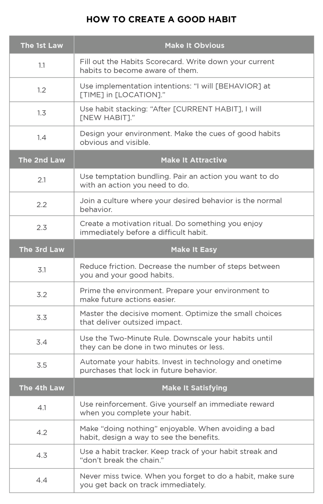

Around the end of last year, I bought the Atomic Habits book at Fully Booked Iloilo, a bookstore in Iloilo City in the Philippines, and I've learned how habits work scientifically, how to build good habits in 4 simple steps, and how to break bad ones from the Atomic Habits book.

In this article, I will share about behavior change, how habits work, how to build good habits and break bad ones simply, and why small habits lead to long-term and remarkable results, as the Atomic Habits book summary.

> Habits are the compound interest of self-improvement. That means small and consistent habits lead to remarkable and long-term results over time.

## Summary: Key Points

What you'll learn in this article:

- A system of Atomic Habits and how it works.
- Why small habits make a big difference and are so effective.
- Building Identity-based habits and systems over goals.
- The science of how habits work and how to improve them.
- The Four Laws of Behavior Change for creating good habits and breaking bad ones.

## Introduction to Atomic Habits

James Clear's Atomic Habits book provides a comprehensive and practical framework for building good habits and breaking bad ones. It's a highly practical and impactful guide for personal development.

The core theme of the Atomic Habits book is 1% better every day, and this book focused on the power of tiny changes. That means building good habits, focusing on small, incremental changes that accumulate over time, leading to big and remarkable results, instead of relying on motivation and willpower.

The author explains details about The Four Laws of Behavior Change based on scientific research, psychological insights, and actionable strategies for building good habits and breaking bad ones.

## The Fundamentals: 3 Keys of Atomic Habits

### (1) Building Identity-Based Habits

James Clear has discussed Identity-based habits in the Atomic Habits book as a key for building lasting habits. He said changing our habits is challenging for two reasons:

1. We try to change the wrong thing.
2. We try to change our habits in the wrong way.

In this section, to understand the first point, we will explore and learn what identity-based habits are.

There are Three Layers of Behavior Change. You can imagine them like the layers of an onion.

- **The first layer is changing your outcomes:** This level is concerned with changing your results. For example, losing weight, publishing a book. Most of the goals you set are associated with this level.

- **The second layer is changing your processes:** This level is concerned with changing your habits and systems. For example, decluttering your desk for better workflow, developing a meditation practice. Most of the habits you build are associated with this level.

- **The third layer is changing your identity:** This level is concerned with changing your beliefs. For example, your self-image, your worldview. Most of the beliefs, assumptions, and biases you hold are associated with this level.

In simple words,

> **Outcomes** are about what you get. **Processes** are about what you do. **Identity** is about what you believe.

Identity-based habits like this:

**(3) Identity ⟶  (2) Processes ⟶  (1) Outcomes**

The author said many people begin the process of changing their habits by focusing on what they want to achieve, which leads to Outcome-based habits. The alternative is to build Identity-based habits; that is to start by focusing on who we wish to become.

Basically, Identity-based habits are focused on what type of person you become. A key to building lasting habits is focusing on creating a new identity first. The author explains true behavior change is identity change. You might start a habit because of motivation. But the only reason you will stick with one is that it becomes part of your identity.

Your behaviors are usually a reflection of your identity. What you do is an indication of the type of person you believe that you are, either consciously or unconsciously.

For example, you can think like this:

 - The goal is to become a reader; instead of thinking of reading a book.
 - The goal is to become a writer; instead of thinking of writing a book.
 - This goal is to become a runner; instead of thinking of running a marathon.

How to Implement Identity-Based Habits?

The author provides a two-step process for changing your identity:

1. Decide the type of person you want to be.
2. Prove it to yourself with small wins.

#### Step (1): Decide the type of person you want to be.

This is the first and important step in your changing your habit. You need to clearly define the identity you want to be. And ensure it's an identity you genuinely desire.

For example,

  - If you want to read a book, your identity could be "I am a reader," instead of saying, "I want to read a book."
  - If you want to write a book, your identity could be "I am a writer," instead of saying, "I want to write a book."
  - If you want to lose weight, your identity could be "I am a healthy and active person," instead of saying, "I want to lose weight."

#### Step (2): Prove it to yourself with small wins.

Once you have defined the person you want to be, start taking small and consistent actions that align with your identity. Every action you take is like casting "a vote" for the type of person you become. Those small actions show what type of person I am.

For example,

  - If you want to be a healthy person, start with something like "I will eat two servings of vegetables with dinner."
  - If you want to be a writer, start with something like "I will write one sentence every day" or "I will write for 5 minutes, three days a week."

### (2) Building Systems over Goals

Most of the people, including me, have goals. But most have failed to achieve their goals. That's why they don't have the systems to achieve goals. James Clear discussed problems of goals:

  - Problem #1: Winners and Losers have the same goals.
  - Problem #2: Achieving a goal is only a momentary change.
  - Problem #3: Goals restrict your happiness.
  - Problem #4: Goals are at odds with long-term progress.

The author also explains the difference between goals and systems.

> Goals are about the results you want to achieve. Systems are about the processes that lead to those results.

  - If you are a coach, your goal might be to win a championship. Your system is the way you recruit players, manage your assistant coaches, and conduct practice.
  - If you are an entrepreneur, your goal might be to build a successful business. Your system is how you test product ideas, hire employees, and run marketing campaigns.

So, are goals are completely useless? Of course not.

> Goals are good for setting a direction, but systems are best for making progress.

#### A System of Atomic Habits

The core theme or overall system of the Atomic Habits book is 1% better every day. That means building good habits focusing on small, incremental changes that accumulate over time, leading to big and remarkable results, instead of relying on motivation and willpower.

James Clear encourages building overall systems and environments to make good habits inevitable and bad habits harder, instead of relying on only setting goals.

An atomic habit refers to a small or tiny change, a marginal gain, 1% improvement. Just as atoms are building blocks of molecules, atomic habits are building blocks of big, long-term, and remarkable results.

### (3) Why Small Habits Make a Big Difference

Here is a brief summary of the benefits of small habits and how they can make a big difference. These are the things I use myself. You can also read about them in the Atomic Habits book.

Most of the people think that these small habits are not very effective and that they don’t produce good results. But in reality, they really do work. Why are small habits so effective?

  - **Ease of doing:** Small habits are easy for everyone to do. You can easily incorporate them into your daily routine.
  
  - **Consistency:** Small habits are more consistent. This should not be done randomly, but rather as a regular daily routine—you should specify what you will do after each task. Having a daily routine is scientifically good for your brain health. This is because the brain knows that it will do the tasks it needs to do at that time without having to think too much. It is more comfortable for the brain. Otherwise, the brain would be thinking about what to do. For example, after breakfast, you will write or read a book.
  
  - **Compound Effect:** What is the Compound Effect? By doing a small daily habit, you will get big results over time. If you do 1% better each day and repeat it for a year, you will lead to good results. This is mainly discussed in the Atomic Habits book.
  
  - **Mentally, it motivates you to do more:** By doing these small daily habits, you will feel like you have done something, which will motivate you to do more the next day. Another thing is that it is not a big deal, but every time you do something, you release dopamine. This gives you a sense of satisfaction and happiness, which motivates you to keep doing it.

## The Science of How Habits Work

A habit is a behavior that has been repeated enough times to become automatic. And any habit can be broken down into a habit loop that involves four steps: cue, craving, response, and reward.

The Atomic Habits book focuses heavily on the science of habit formation, particularly the concept of the habit loop.

### The Four Stages of a Habit or Habit Loop

The process of building a habit can be divided into four simple steps: cue, craving, response, and reward. This four-step pattern is the backbone of every habit, and your brain runs in the same order each time. Let's explore and try to understand what a habit is, how it works, and how to improve it.

- Cue — The Trigger: The first step of the habit loop. The cue triggers your brain to initiate a behavior. It's a piece of information that predicts a reward. Cues can be anything from a specific location, an emotional state, and a time of day. The cue is the first indication that we’re close to a reward; it naturally leads to a craving.

- Craving — The Motivation: The second step of the habit loop. Craving is the motivational force behind every habit. Once a cue is initiated, it leads to craving. Every craving is linked to a desire to change your internal state.

- Response — The Action: The response is the third step of the habit loop. The response is the actual habit or actual behavior you perform, which can take the form of a thought or an action. Whether you perform the response depends on how motivated you are and how easy or difficult the action is.

- Reward — The Reinforcement: The reward is the final step of the habit loop. The reward is the end goal of every habit. It's the satisfaction you get from performing the response. In simple words, the reward is the good feeling or benefit you get immediately after doing the habit.

The author simply explains the cue triggers a craving, which motivates a response, which provides a reward, which satisfies the craving, and ultimately becomes associated with the cue.

To understand the habit loop or four stages of a habit—cue, craving, response, and reward clearly, please see the following examples. These examples are also described in the Atomic Habits book.

Example One,
  1. Cue: Your phone buzzes with a new text message.
  2. Craving: You want to learn the contents of the message.
  3. Response: You grab your phone and read the text.
  4. Reward. You satisfy your craving to read the message. Grabbing your phone becomes associated with your phone buzzing.

Example Two,
  1. Cue: You are answering emails.
  2. Craving: You begin to feel stressed and overwhelmed by work. You want to feel in control.
  3. Response: You bite your nails.
  4. Reward. You satisfy your craving to reduce stress. Biting your nails becomes associated with answering email.

Example Three,
  1. Cue: You wake up.
  2. Craving: You want to feel alert.
  3. Response: You drink a cup of coffee.
  4. Reward. You satisfy your craving to feel alert. Drinking coffee becomes associated with waking up.

Example Four,
  1. Cue: You smell a doughnut shop as you walk down the street near your office.
  2. Craving: You begin to crave a doughnut.
  3. Response: You buy a doughnut and eat it.
  4. Reward. You satisfy your craving to eat a doughnut. Buying a doughnut becomes associated with walking down the street near your office.

## The Four Laws of Behavior Change

These above four steps form a neurological feedback loop—cue, craving, response, and reward—that ultimately allows you to create automatic habits. This cycle is known as the habit loop.

James Clear, the author of the Atomic Habits book, introduces Four Laws of Behavior Change based on this habit loop as a practical framework for building good habits and breaking bad ones.

You can use these four laws of behavior change to build a good habit:

  - The 1st Law (Cue) ▸ Make it obvious.
  - The 2nd Law (Craving) ▸ Make it attractive.
  - The 3rd Law (Response) ▸ Make it easy.
  - The 4th Law (Reward) ▸ Make it satisfying.

You can invert these four laws of behavior change to break a bad habit:

  - Inversion of the 1st Law (Cue) ▸ Make it invisible.
  - Inversion of the 2nd Law (Craving) ▸ Make it unattractive.
  - Inversion of the 3rd Law (Response) ▸ Make it difficult.
  - Inversion of the 4th Law (Reward) ▸ Make it unsatisfying.

## How to Build a Good Habit and Break a Bad Habit

The following Atomic Habits summary cheat sheet compresses the key ideas and insights to build a good habit and break a bad habit from the Atomic Habits book.

As we discussed above, we can use the four laws of behavior change to build a good habit and break a bad habit. Let's explore and learn details in the next sections.

---

## The 1st Law (Cue): Make it Obvious
> For Creating a Good Habit

To start a new good habit, you need to make its cue unmistakable. The 1st Law, Make it Obvious, focuses on making the triggers for your desired behaviors as noticeable as possible.

This involves the following strategies:

  - The Habits Scorecard
  - Implementation Intentions
  - Habit Stacking
  - Design Your Environment

### The Habits Scorecard

The habits scorecard is a simple exercise you can use to become more aware of your behavior. Make a list of your daily habits. Once you have a full list, look at each habit. If it's a good habit, write "+". If it's a bad habit, write "-". If it's a neutral habit, write "=".

For example,

  - Wake up =
  - Turn off alarm =
  - Check my phone -
  - Scroll social media -
  - Go to the bathroom =
  - Weigh myself +
  - Take a shower +
  - Brush my teeth +
  - Floss my teeth +
  - Put on deodorant +
  - Get dressed =
  - Make a cup of tea +

This habits scorecard helps you to become aware of current cues and your behaviors. But it will depend on your situation and goals.

For example,

For someone who is trying to lose weight, eating a bagel with peanut butter every morning might beme a bad habit. For someone who is trying to bulk up and add muscle, the same behavior might be a good habit.

### Implementation Intentions

An implementation intention is a plan you make beforehand about when and where to act. Clearly define when and where you will perform a new good habit.

Format,

  - I will [BEHAVIOR] at [TIME] in [LOCATION].

For example,

  - Exercise: I will exercise for one hour at 5:00 PM in my local gym.
  - Studying: I will study Spanish for 20 minutes at 6:00 PM in my bedroom.

### Habit Stacking - A Simple Plan to Overhaul Your Habits

The best way to start a new good habit is Habit Stacking. What is it? It is easy to say that after a current habit, you start a new habit.

Format,

  - After I do [CURRENT HABIT], I will do [NEW HABIT].

For example,

  - Reading: After watching the news every night, I will read for 30 minutes.
  - Exercise: After I take off my work shoes, I will immediately change into my workout clothes.

Habit Stacking works for me. Doing this small habit every day is more effective than doing it for two hours a week. But you need to be specific and consistent about what you are going to do after that. I encourage you to try this method.

### Design Your Environment
> Motivation Is Overrated; Environment Often Matters More

Every habit is initiated by a cue, so make the cues for good habits visible and accessible in your environment. Creating obvious visual cues can draw your attention toward a desired habit. It's easier to build new good habits in a new environment because you don't need to fight old cues.

Here are a few ways to design your environment and make the cues for your habits more obvious.

Examples,

  - If you want to practice guitar more frequently, place your guitar stand in the middle of the living room.
  - If you wan to drink more water, fill up a few water bottles each morning and place them in common locations around the house.

## Inversion of the 1st Law (Cue): Make it Invisible
> For Breaking a Bad Habit

The Inversion of the 1st Law, Make it Invisible, means reducing exposure and removing the cues of your bad habits from your environment.

This involves the following strategies:

  - Reduce Exposure
  - Change Your Environment

**Reduce Exposure:** Make the triggers for bad habits invisible to see or access.

For example,

  - Unsubscribe from tempting email lists.
  - Keep unhealthy snacks out of sight in a cupboard or don't buy them.
  - Turn off notifications on your phone
  - Put your gaming console in a closet.

**Change Your Environment:** If certain environments trigger bad habits, avoid them or modify them.

For example,

  - If you overspend at the mall, avoid going to the mall.
  - If you always snack when watching TV, watch TV in a different room or keep all food out of that room.

---

## The 2nd Law (Craving): Make it Attractive
> For Creating a Good Habit

The 2nd Law, Make it Attractive, focuses on increasing your desire or craving for a good habit, or making bad habits less appealing. We are more likely to pursue behaviors that are associated with positive feelings or immediate rewards.

This involves the following strategies:

  - Temptation Bundling
  - Join a Culture Where Your Desired Behavior is the Norm

### Temptation Bundling

Temptation bundling means pairing an action you WANT to do with an action you NEED to do. This makes the necessary habit more attractive.

For example,

  - I will listen to my favorite songs (want) while I read a book (need).
  - I will listen to my favorite podcast (want) while I clean the dishes (need).

### Join a Culture Where Your Desired Behavior is the Norm

We are heavily influenced by the people around us. If your desired habit is the norm in your social group, you'll find it more attractive.

For example,

  - If you want to learn English, find an English study group.
  - Join a running club, find a study group, and participate in a community garden.

## Inversion of the 2nd Law (Craving): Make it Unattractive
> For Breaking a Bad Habit

The Inversion of the 2nd Law, Make it Unattractive, means associating your bad habits with negative consequences or feelings.

This involves the following strategies:

  - Highlight the Benefits of Avoiding Your Bad Habits

**Highlight the Benefits of Avoiding Your Bad Habits:** To make your bad habits seem unattractive, highlight the benefits of avoiding your bad habits.

For example,

  - By avoiding eating this junk food, I will feel energized, light, and focused for the rest of the day.
  - By avoiding procrastination and starting now, I will feel calm, in control, and confident, knowing I'm making progress.

---

## The 3rd Law (Response): Make it Easy
> For Creating a Good Habit

The 3rd Law, Make it Easy, focuses on reducing the friction and effort required to perform good habits and designing your environment to make the desired action as effortless as possible.

This involves the following strategies:

  - Reduce Friction
  - Prime the Environment
  - The Two-Minute Rule

### Reduce Friction

This means decreasing the number of steps between you and your good habits.

For example,

  - Prepare your coffee maker the night before so all you have to do is press a button.
  - Place the book you want to read directly on your pillow or nightstand. Open it to the page you left off on.

### Prime the Environment

This means preparing your environment to make future actions easier.

For example,

  - Lay out your workout clothes the night before.
  - Organize your workspace before leaving for the day.

### The Two-Minute Rule

The Two-Minute Rule states when you start a new habit, it should take less than two minutes to do.

  - "Run three miles" becomes "Tie my running shoes."
  - "Read before bed each night" becomes "Read on page."

Consider simplifying any new habit to a version that can be completed in under two minutes. The idea is to make your habits as easy as possible to start.

The author explains a new habit should not feel like a challenge. And the actions that follow can be challenging, but the first two minutes should be easy. You can usually figure out the gateway habit that leads to your desired outcome by mapping out your goals on a scale from Very easy to Very hard.

For example,

  - **Very easy:** Put on your running shoes.
  - **Easy:** Walk ten minutes.
  - **Moderate:** Walk ten thousand steps.
  - **Hard:** Run a 5K.
  - **Very Hard:** Run a marathon.

## Inversion of the 3rd Law (Response): Make it Difficult
> For Breaking a Bad Habit

The Inversion of the 3rd Law, Make it Difficult, means increasing the friction or effort to perform the undesired action.

This involves the following strategies:

  - Increase Friction
  - Use Commitment Devices

**Increase Friction:** This means adding steps or effort to make the bad habit harder to do.

For example,

If you want to spend less time on social media, delete the apps from your phone and only access them on your computer.

**Use Commitment Devices:** A commitment device is a choice you make in the present that controls your actions in the future. It's a way to lock in your future behavior, bind you to good habits, and restrict you from bad ones.##

For example,

  - Give your phone to a friend during study time.
  - When Victor Hugo shut his clothes away so he could focus on writing.

---

## The 4th Law (Reward): Make it Satisfying
> For Creating a Good Habit

The 4th Law, Make it Satisfying, focuses on ensuring that the reward for your good habit is immediate and pleasureable, and this law emphasizes that if the experience is immediately satisfying, a behavior is more likely to be repeated.

This involves the following strategies:

  - Immediate Reinforcement
  - Use Habit Trackers

### Immediate Reinforcement

Immediate reinforcement means giving yourself an immediate reward when you complete a habit. Choose a small, immediate reward that you genuinely enjoy.

For example,

  - After your workout, listen to your favorite podcast.
  - After writing for 30 minutes, watch your favorite funny YouTube video.

### Use Habit Trackers

A habit tracker is a simple way to measure whether you did a habit, like marking "X" on your calendar. Habit trackers can make your habits satisfying by providing clear evidence of your progress.

For example,

  - Mark an "X" on your calendar each day after you complete a habit.
  - Physically cross it off your TODO list after you have finished your tasks.

## Inversion of the 4th Law (Reward): Make it Unsatisfying
> For Breaking a Bad Habit

The Inversion of the 4th Law, Make it Unsatisfying, focuses on making the consequences of your bad habits painful or unsatisfying. If it is painful or unsatisfying, we are less likely to repeat a bad habit.

This involves the following strategies:

  - Accountability Partner
  - Habit Contracts and Promises

**Accountability Partner:** An accountability partner can create an immediate cost to inaction. Tell someone your goals and let them check in on your progress, and then knowing someone is watching makes failure more unsatisfying.

For example,

Message or tell a friend if you skip reading, and they can send you a reminder.

**Habit Contracts and Promises:** A public contract can be used to add a social cost to any behavior; that's a powerful way to add an immediate, unsatisfying cost to a bad habit.

Make a public declaration of your intention to break a bad habit. The social cost of failing can be a powerful dissatisfier.

For example,

Starting today, I'm committing to a digital detox. No social media scrolling after 8:00 PM every day.

---

